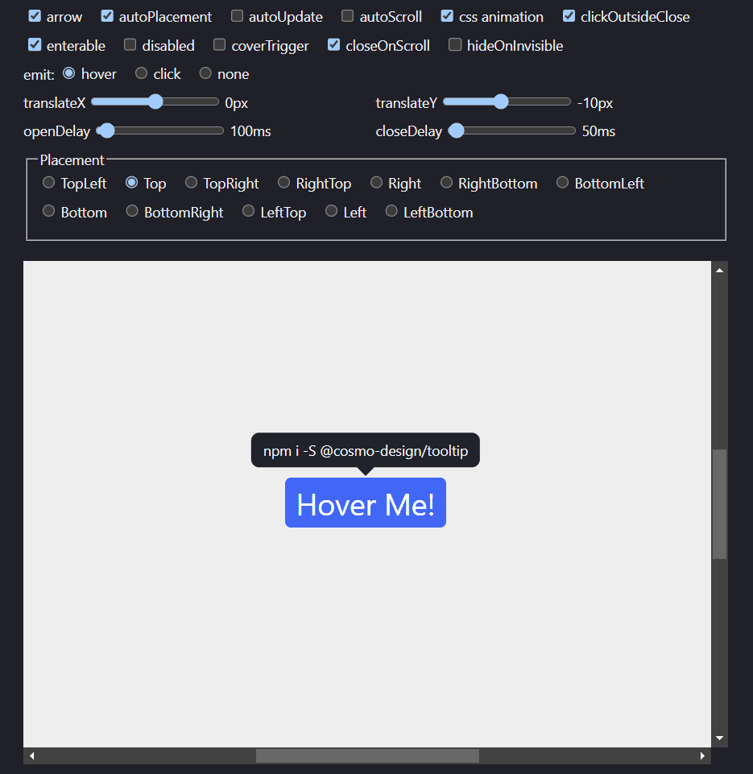

# [Tooltip](https://nodesignjs.github.io/tooltip/)

[](https://github.com/nodesignjs/tooltip) 
[](https://github.com/nodesignjs/tooltip)

@nodesign/tooltip is a powerful and flexible tooltip pure JS library based on [@nodesign/popper](https://github.com/nodesignjs/popper).

[Playground](https://nodesignjs.github.io/tooltip/)

[](https://nodesignjs.github.io/tooltip/)

[中文文档](./README_zh.md)

## Install

```
npm i -S @nodesign/tooltip
```

or via CDN

```html
<link rel="stylesheet" href="https://unpkg.com/@nodesign/tooltip@latest/dist/index.min.css">
<script src="https://unpkg.com/@nodesign/tooltip@latest/dist/index.min.js"></script>
<script>
  console.log(tooltip)
</script>
```

## Usage

```js
import Tooltip from '@nodesign/tooltip'
import '@nodesign/tooltip/es/index.css'
// or import '@nodesign/tooltip/es/index.scss'
// or import '@nodesign/tooltip/dist/index.min.css'

const container = document.querySelector('.container'); // default: document.body
const trigger = document.querySelector('.trigger'); 
// or virtual element. type: { getBoundingClientRect: () =>  { left: number, top: number, width: number, height: number } }

const tooltip = new Tooltip({
  container,
  trigger, // required
  content: 'It can be a string or a DOM element.', // It will not be displayed when it is an empty string.
})

setTimeout(() => {
  tooltip.updateConfig({ // You can update any parameter using the updateConfig method.
    content: 'xxx'
  })
}, 5000)

// if you don't need it anymore
tooltip.destroy()
```

You can refer to the documentation of [@nodesign/popper](https://github.com/nodesignjs/popper/blob/main/README.md) for a complete tutorial.

### CSS Style

The class names and CSS variables of Tooltip begin with `ndt`.

```css
--ndt-color: #fff; // font color
--ndt-bg: #1f2329; // background color
--ndt-padding: 8px 12px; // padding
--ndt-radius: 8px; // radius
--ndt-arrow: 12px; // The width and height of the arrow element
--ndt-shadow: 0; // box shadow
```

You can customize the style by modifying CSS variables.

```css
html[data-theme='dark'] .ndt, html.dark .ndt {
  --ndt-bg: #373739;
}
```

### CSS Animation

Please refer to the [@nodesign/popper CSS animation parameters](https://github.com/nodesignjs/popper/tree/main#css-animation) for more information.

Tooltip has added `ndt_ani` as the default CSS animation name, and you can customize the CSS animation by configuring the `cssName` parameter.

```js
const tooltip = new Tooltip({
  cssName: 'fade'
})
```

You can write the following CSS styles:

```css
.fade-enter-from, .fade-exit-to {
  transform: scale(.7);
  opacity: 0;
}
.fade-enter-active, .fade-exit-active {
  transition: transform .1s ease, opacity .1s ease;
}
```

### Arrow

You can configure a custom arrow element using the arrow parameter. By default, a `div` element with a class name of `ndt_arrow` will be added as the arrow element.

```js
const arrow = document.createElement('div')
arrow.classList.add('arrow')

const popper = new Tooltip({
  arrow: true, // default
  // arrow: false Do not display the arrow element.
  // arrow: document.createElement('div') Customize the arrow element.
})
```

## API

Please refer to the [@nodesign/popper API documentation](https://github.com/nodesignjs/popper/blob/main/README.md) for the complete API.

### Config

| Name | Type | Description |
| -- | -- | -- |
| `content` | `string \| Node` | Content to be displayed |
| `arrow` | `boolean \| Node` | Arrow element |
