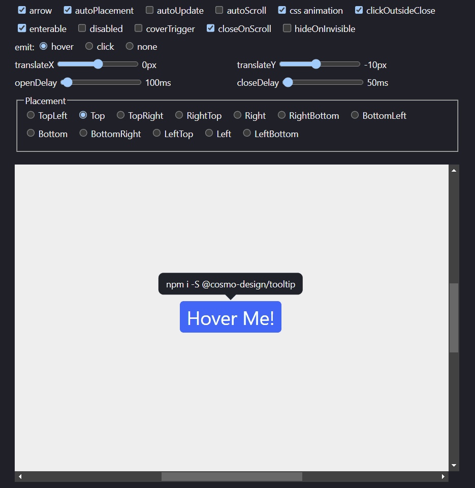

# [Tooltip](https://nodesignjs.github.io/tooltip/)

[](https://github.com/nodesignjs/tooltip) 
[](https://github.com/nodesignjs/tooltip)

@nodesign/tooltip 是功能强大，配置灵活的 tooltip 纯 JS 库，基于 [@nodesign/popper](https://github.com/nodesignjs/popper).

[在线体验](https://nodesignjs.github.io/tooltip/)

[](https://nodesignjs.github.io/tooltip/)

[English](./README_zh.md)

## 安装

```
npm i -S @nodesign/tooltip
```

或者通过 CDN 使用

```html
<link rel="stylesheet" href="https://unpkg.com/@nodesign/tooltip@latest/dist/index.min.css">
<script src="https://unpkg.com/@nodesign/tooltip@latest/dist/index.min.js"></script>
<script>
  console.log(tooltip)
</script>
```

## 快速开始

```js
import Tooltip from '@nodesign/tooltip'
import '@nodesign/tooltip/lib/index.css'
// 或者 import '@nodesign/tooltip/lib/index.scss'
// 或者 import '@nodesign/tooltip/dist/index.min.css'

const container = document.querySelector('.container'); // 默认: document.body
const trigger = document.querySelector('.trigger'); 
// 或者虚拟元素. 类型: { getBoundingClientRect: () =>  { left: number, top: number, width: number, height: number } }

const tooltip = new Tooltip({
  container,
  trigger, // 必填
  content: '可以是字符串或者是 DOM 元素' // 为空字符串时不会展示
})

setTimeout(() => {
  tooltip.updateConfig({ // 通过 updateConfig 方法可以更新任意参数
    content: 'xxx'
  })
}, 5000)

// 如果你不需要 Tooltip 了
tooltip.destroy()
```

完整教程可以参考 [@nodesign/popper 文档](https://github.com/nodesignjs/popper/blob/main/README_zh.md)。

### CSS 样式

Tooltip 的类名和 CSS 变量以 `ndt` 为开头。

```css
--ndt-color: #fff; // 字体颜色
--ndt-bg: #1f2329; // 背景色
--ndt-padding: 8px 12px; // padding
--ndt-radius: 8px; // radius
--ndt-arrow: 12px; // 箭头的宽高
--ndt-shadow: 0; // box shadow
```

你可以通过修改 CSS 变量来自定义样式。

```css
html[data-theme='dark'] .ndt, html.dark .ndt {
  --ndt-bg: #373739;
}
```

### CSS 动画

参考 [@nodesign/popper CSS 动画参数](https://github.com/nodesignjs/popper/blob/main/README_zh.md#css-%E5%8A%A8%E7%94%BB)。

Tooltip 添加了默认 `ndt_ani` 为 CSS 动画名，你可以通过配置 `cssName` 参数自定义 CSS 动画。

```js
const tooltip = new Tooltip({
  cssName: 'fade'
})
```

你可以编写如下 CSS 样式。

```css
.fade-enter-from, .fade-exit-to {
  transform: scale(.7);
  opacity: 0;
}
.fade-enter-active, .fade-exit-active {
  transition: transform .1s ease, opacity .1s ease;
}
```

### 箭头

通过 `arrow` 参数可以配置自定义箭头元素。默认会添加一个类名为 `ndt_arrow` 的 `div` 作为箭头元素。

```js
const arrow = document.createElement('div')
arrow.classList.add('arrow')

const popper = new Tooltip({
  arrow: true, // 默认为 true
  // arrow: false 不要箭头
  // arrow: document.createElement('div') 自定义箭头元素
})
```

## API

完整 API 请参考 [@nodesign/popper API 文档](https://github.com/nodesignjs/popper/blob/main/README_zh.md)

### 配置

| 参数 | 类型 | 描述 |
| -- | -- | -- |
| `content` | `string \| Node` | 要展示的内容 |
| `arrow` | `boolean \| Node` | 箭头元素 |
